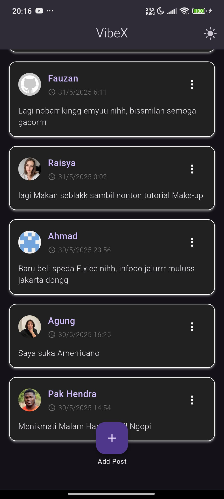
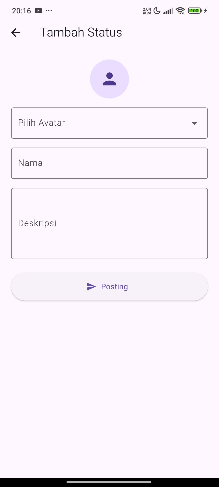
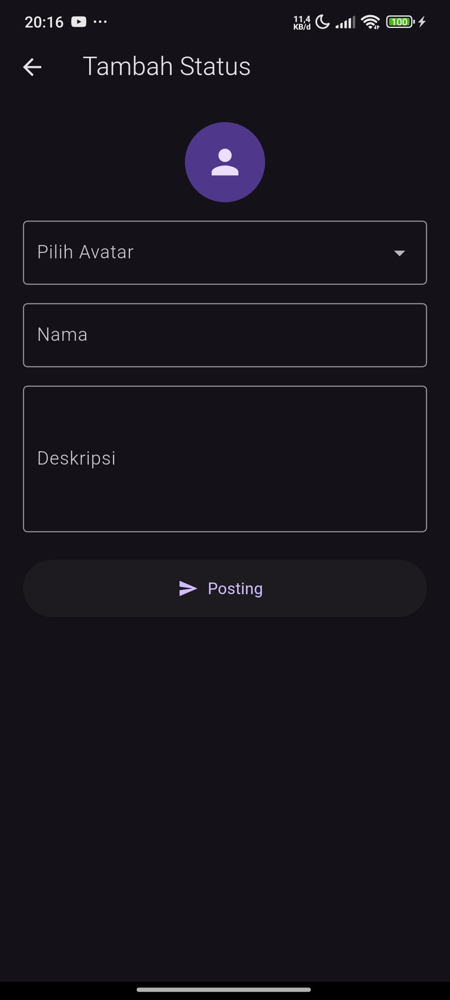
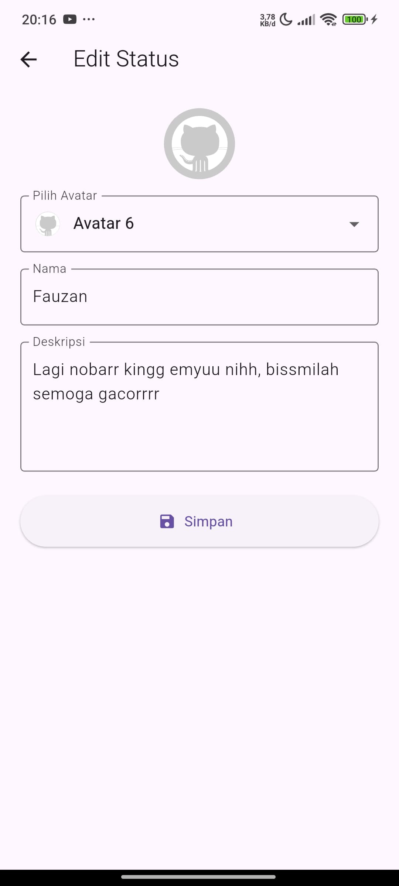
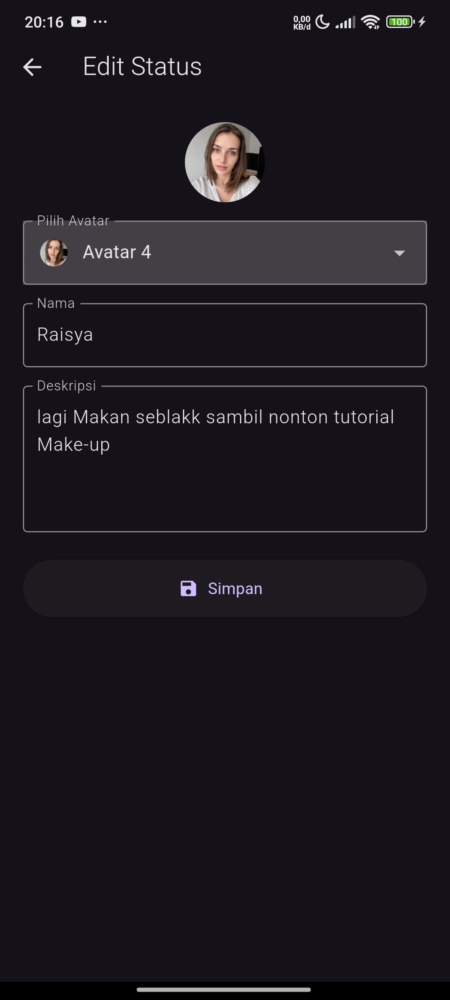
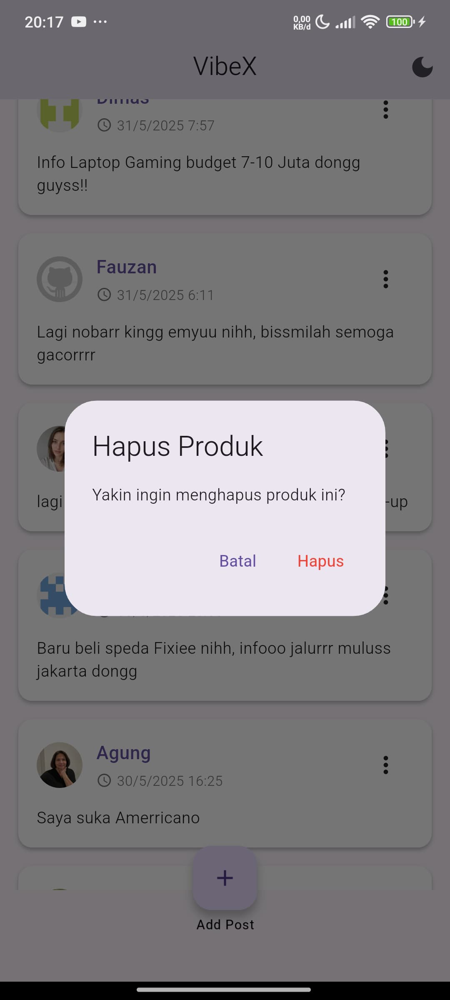

# VibeX

VibeX adalah aplikasi memposting utas/status ,berbagi pengalaman pribadi, menuangkan pikiran ,curhat, dsb.

## Tentang aplikasi

Pengguna bisa membuat posting (tulisan singkat) melalui tombol "+" (Add Post) yang ada di bagian bawah layar.

Posting ditampilkan dalam bentuk daftar, lengkap dengan nama pengguna, avatar/icon, tanggal dan waktu posting, serta isi posting.

Ada menu titik tiga ("...") di setiap posting, kemungkinan besar digunakan untuk mengedit, menghapus, atau menampilkan opsi tambahan.

## Tampilan Menu:

Sederhana dan bersih, dengan latar belakang dominan putih/ungu muda.

Avatar pengguna ditampilkan di sebelah kiri setiap posting.

Teks nama pengguna ditampilkan tebal berwarna ungu (atau warna lainnya) agar mudah dibedakan.

Tanggal dan waktu posting ditampilkan di bawah nama pengguna.

Tombol tambah posting (FAB - Floating Action Button) ada di tengah bawah layar.

🌙 Tentang Icon Tema (Light/Dark Mode):
Di pojok kanan atas header, terdapat sebuah ikon bulan sabit 🌙. Ini biasanya adalah ikon untuk toggle tema (Light Mode <-> Dark Mode). Fungsi ikon ini:

Jika ikon bulan sabit 🌙 aktif (seperti pada tangkapan layar), kemungkinan saat ini aplikasi sedang dalam Light Mode, dan pengguna bisa mengetuk ikon ini untuk beralih ke Dark Mode.

Jika diubah ke Dark Mode, biasanya latar belakang akan berubah menjadi gelap, teks menjadi terang, dan beberapa warna aksen mungkin ikut berubah.

## 📸 Preview

Berikut adalah beberapa tangkapan layar aplikasi:

